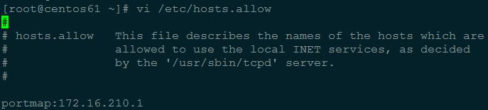
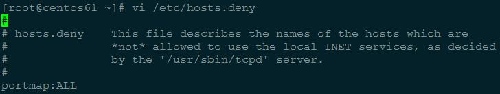
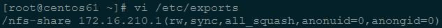
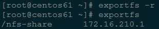
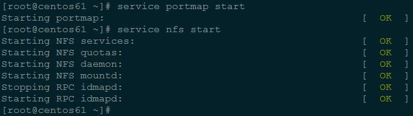
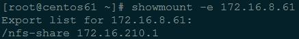
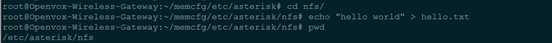

# OpenVox GSM Gateway 上挂载 NFS

## （一）NFS 服务器配置

	本 NFS 服务器为 CentOS 5.9，CentOS 6 以上请将以下 portmap 改为 rpcbind

	安装相关软件：
		yum install nfs-utils portmap

 
	配置允许访问的主机，编辑文件 /etc/hosts.allow：
		vi /etc/hosts.allow
		portmap:172.16.210.1
		

		
	配置拒绝访问的主机，编辑文件 /etc/hosts.deny：
		vi /etc/hosts.deny
		portmap:ALL
		

	配置共享目录信息，编辑文件 /etc/exports：
		vi /etc/exports
		/nfs-share 172.16.210.1(rw,sync,all_squash,anonuid=0,anongid=0)

	注意：
		id root
			uid=0(root) gid=0(root) groups=0(root),1(bin),2(daemon),3(sys),4(adm),6(disk),10(wheel)

		rw: read and write
		sync: sync your change to disk
		all_squash: all users chage to nobody
		anonuid: allow uid
		anongid: allow gid

 
 
	使共享目录设置生效：
		exports -r
		exports
		
 
 
	启动NFS服务：
 		service portmap start
		service nfs start
		

	检查NFS共享目录设置：
		showmount -e 172.16.8.61

## （二）OpenVox GSM Gateway 挂载 NFS

	挂载 NFS 共享目录，并在 NFS 共享目录中创建文件：
		cd nfs
		echo "hello" > hello.txt
		pwd
		cd /etc/asterisk
		mkdir nfs
		mount -o nolock -t nfs 172.16.8.61:/nfs-share nfs

	在 NFS 服务器中查看创建的文件：
		cd /nfs-share
		ls
		cat hello.txt
		pwd
 

 
	卸载 NFS 共享目录：
		umount nfs
		ls nfs

## 问题集

	1) mount: 172.16.8.88:/root failed, reason given by server: Permission denied
		all_squash,anonuid=0,anongid=0

	2) mount clntudp_create : RPC Program not registered
		/etc/hosts.allow
			portmap:172.16.8.88

	3) mount: mount to NFS server '172.16.8.88' failed: System Error: No route to host.
		server: service iptables start

	4) /usr/sbin/start-statd: line 8: systemctl: command not found
		mount.nfs: rpc.statd is not running but is required for remote locking.
		mount.nfs: Either use '-o nolock' to keep locks local, or start statd.
		mount.nfs: an incorrect mount option was specified
		client: mount -o nolock -t nfs 172.16.8.61:/root nfs
					   |-------|

	5) CentOS 7:
		[~]# service iptables start
		[~]# service rpcbind restart
		[~]# service nfs restart
