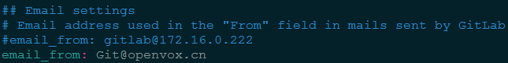
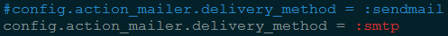
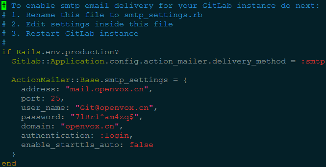

# omnibus-gitlab

## 安装 omnibus-gitlab

	sudo yum install openssh-server
	sudo yum install postfix
	sudo yum install cronie
	sudo service postfix start
	sudo chkconfig postfix on
	rpm -Uvh gitlab-7.4.3_omnibus.1-1.el6.x86_64.rpm
	vi /etc/gitlab/gitlab.rb
		external_url 'http://172.16.0.222'
	gitlab-ctl reconfigure
	sudo lokkit -s http -s ssh
	gitlab-ctl restart

	使用上面设置的 172.16.0.222 在浏览器中登陆 GITLAB
	预设用户名密码：root/5iveL!fe
	
## 使用

	检查 GITLAB 设置: gitlab-rake gitlab:check
	启动/停止/查看运行状态：gitlabctl start|stop|status

### BUG

	gitlab-7.4.3 BUG：备份文件中如有空项目，恢复时会失败

### GITLAB 备份

	GITLAB 备份命令为：gitlab-rake gitlab:backup:create
	备份文件存放在：/var/opt/gitlab/backups/

	编写备份脚本：/opt/gitlab-backup.sh
	添加 crond 定时任务: 
		echo "30 23 * * * root /opt/gitlab-backup.sh" >> /etc/crontab

### GITLAB 恢复备份的文件

	将备份文件拷贝到 /var/opt/gitlab/backups/
	恢复备份的命令：gitlab-rake gitlab:backup:restore
	
### 配置 GITLAB 邮件

	vi /opt/gitlab/embedded/service/gitlab-rails/config/gitlab.yml
		email_from: Git@openvox.cn

	vi /opt/gitlab/embedded/service/gitlab-rails/config/environments/production.rb
		config.action_mailer.delivery_method = :smtp

	vi /opt/gitlab/embedded/service/gitlab-rails/config/initializers/smtp_settings.rb

### 配置 GITLAB+JIRA

	GitLab 7.8.1

### 从 7.4.3 升级至 7.6.1，7.6.1 升级至 7.8.1

	官方升级文档：

[omnibus-gitlab-update](https://gitlab.com/gitlab-org/omnibus-gitlab/blob/master/doc/update.md)

	1. 备份
	2. 
		gitlab-ctl stop unicorn
		gitlab-ctl stop sidekiq

		If you are upgrading from version 7.3.0 and older
			sudo gitlab-ctl stop nginx

	3. 升级
		rpm -Uvh gitlab-7.6.1_omnibus.5.3.0.ci.1-1.el6.x86_64.rpm
	4. 配置
		mv /opt/gitlab/embedded/service/gitlab-rails/config/initializers/smtp_settings.rb .
		gitlab-ctl reconfigure
		cp smtp_settings.rb /opt/gitlab/embedded/service/gitlab-rails/config/initializers/
	5. 重启 GITLAB
		gitlab-ctl restart
		
### 重装

	yum erase gitlab
	rm -rf /etc/gitlab /opt/gitlab /var/opt/gitlab
	reboot your system

	rpm -ivh gitlab-7.4.3_omnibus.1-1.el6.x86_64.rpm
	vi /etc/gitlab/gitlab.rb
		external_url 'http://172.16.0.222'
	gitlab-ctl reconfigure
	gitlab-ctl restart