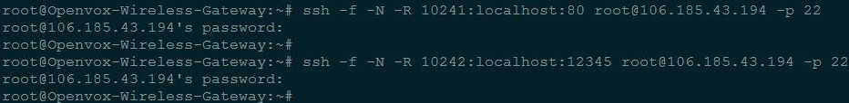
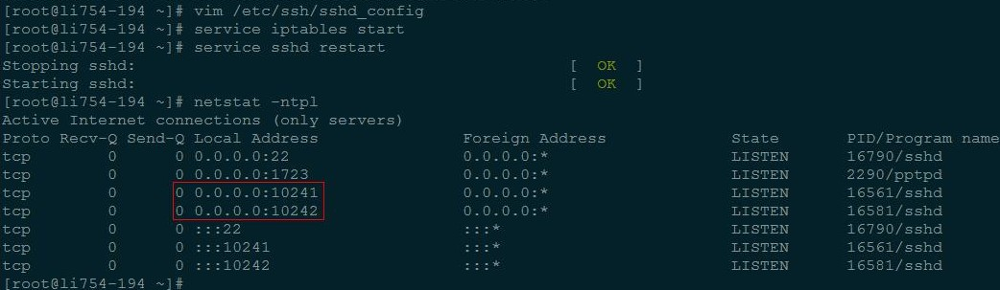
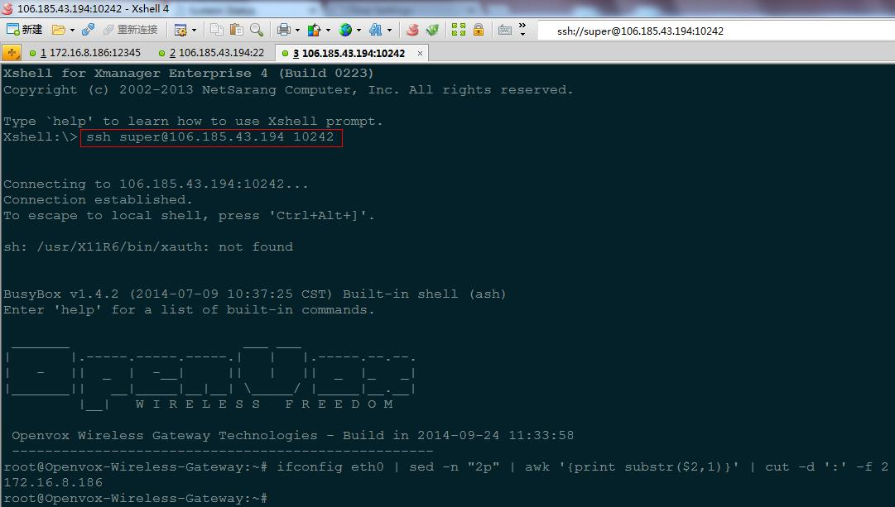
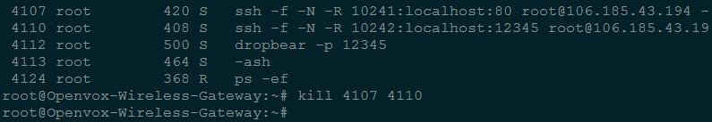
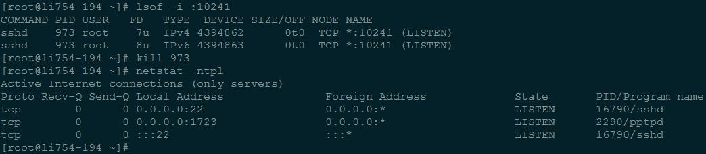
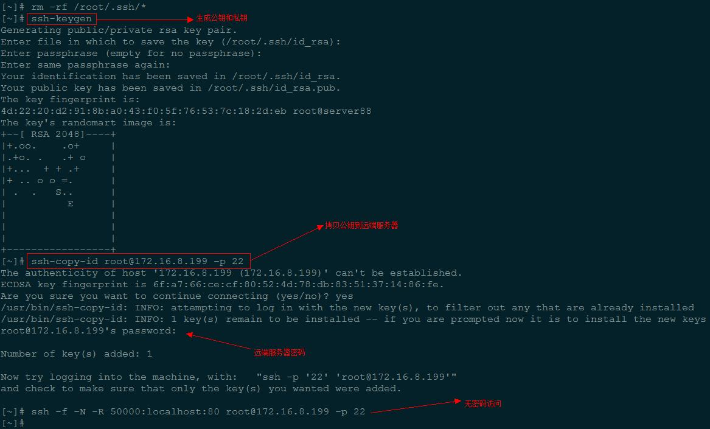

# GSM 网关配置 SSH 反向连接

	作用：使公司内网工作机透过公网服务器访问客户内网的 GSM 网关，以便调试

## （一）服务器配置

	Openvox-Wireless-Gateway
		IP: 172.16.8.186
		Port: SSH 12345, Web Port 80
		Username: Web admin, SSH super

	公网服务器
		IP: 106.185.43.194
		SSH Port: 22
		SSH Username: root

	工作机
		IP: 172.16.8.180

## （二）配置步骤

	1）端口映射（在 GSM 网关上进行操作）
		1.	将网关上的 80 端口映射到公网服务器的 10241 端口
			A.	ssh -f -N -R 10241:localhost:80 root@106.185.43.194 -p 22
			B.	需要输入公网服务器密码
		2.	将网关上的 12345 端口映射到公网服务器的 10242 端口
			A.	ssh -f -N -R 10242:localhost:12345 root@106.185.43.194 -p 22
			B.	需要输入公网服务器密码

	2）配置公网服务器共享 SSH 隧道（在公网服务器上进行操作）
		1.	编辑 /etc/ssh/sshd_conf：设置 GatewayPorts yes
		2.	service iptables start
		3.	service sshd restart

		
## （三）使用 SSH 隧道

	1）从工作机透过公网服务器访问 GSM 网关（在内网工作机上进行操作）
		访问 Web：浏览器使用 106.185.43.194:10241 登陆，输入 GSM 网关 Web端用户名和密码
		访问 SSH：Xshell 使用 ssh 106.185.43.194 10242 登陆，输入 GSM 网关 SSH 端用户名和密码

	2）关闭 SSH 隧道（在 GSM 网关上进行操作）
		使用 ps 命令查找ssh 相应的端口转发进程，使用 kill 命令将其杀掉

		
	3）关闭监听的端口（在公网服务器上进行操作）
		使用 lsof 命令查找监听端口的进程，使用 kill 命令将其杀掉

### （四）SSH 无密码登陆

	1.	使用 ssh-keygen 生成公钥和私钥（一路回车，可以不输入任何信息）
	2.	使用 ssh-copy-id 将公钥拷贝到公网服务器，需输入一次公网服务器密码
	3.	以后便可无需密码连接公网服务器

### （五）SSH 反向连接自动重连

	1.	使用 autossh
		autossh -M 20241 -f -N -R 10241:localhost:80 root@106.185.43.194 -p 22
			-M port[:echo_port]，port 为监听端口，默认的 echo_port=port+1
			autossh 通过 port 和 echo_port 监听 ssh 状态，从 port 发送数据，echo_port 接收数据
	
	注：在 CentOS 上测试，无数据流经过时，5-6 分钟连接失效，但进程仍在
