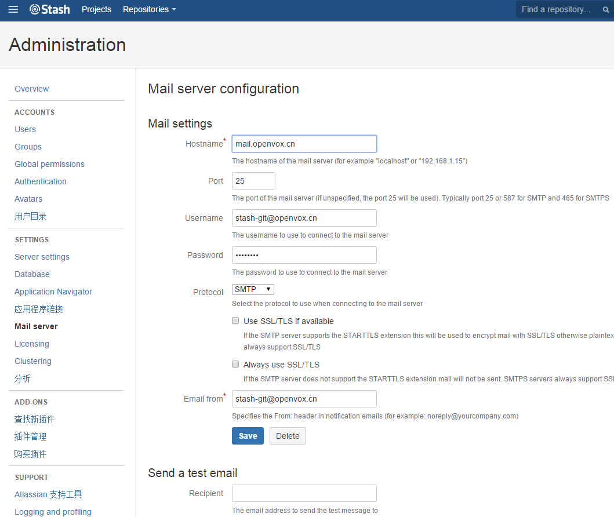

## Atlassian Stash v2.12.1 破解版安装方法

### 安装环境

	如果系统内存低于 512M, 就不要折腾了,非常卡. 推荐 2048M 内存.

	1. centos 6 x64
	2. openjdk 1.7 x64
	3. git version 1.7.12.4

	centos6 下面. 默认的git需要更新. 默认的git版本为 1.7.1. 低于1.7.6. 所以需要更新git

#### 升级 GIT

	rpm -i http://pkgs.repoforge.org/rpmforge-release/rpmforge-release-0.5.3-1.el6.rf.x86_64.rpm
	yum --enablerepo=rpmforge-extras install git-1.7.12.4-1.el6.rfx.x86_64
	安装完成以后. 用 git –version 查看下版本号.

##### 安装 CentOS 6 的 RPMforge

[安装 RPMforge](http://wiki.centos.org/zh/AdditionalResources/Repositories/RPMForge)

	你可以在 http://pkgs.repoforge.org/ 取得所有 RPMforge 组件的清单。

	i386 http://pkgs.repoforge.org/rpmforge-release/rpmforge-release-0.5.3-1.el6.rf.i386.rpm
	x86_64 http://pkgs.repoforge.org/rpmforge-release/rpmforge-release-0.5.3-1.el6.rf.x86_64.rpm

###### 安装 DAG 的 GPG 金钥

	rpm --import http://apt.sw.be/RPM-GPG-KEY.dag.txt

	如果你遇到以下错误，该金钥先前已被输入：
		error: http://apt.sw.be/RPM-GPG-KEY.dag.txt: key 1 import failed.

	审核你所下载的组件
		rpm -K rpmforge-release-0.5.3-1.el6.rf.*.rpm
		<!> 安全性警告： rpmforge-release 这个组件会将数条 GPG 金钥输入你的 RPM 数据库内。你若已审核过确组件的 md5sum，并信任 Dag 等人，那么它的安全性便扩展自你对他们的信任。

###### 安装组件

	rpm -i rpmforge-release-0.5.3-1.el6.rf.*.rpm
	这样做会新增一个 yum 软件库的配置文件及输入应有的 GPG 金钥。

### 正式安装

	1. 下载解压我的压缩包到 ~ 目录下. tar xzf atlassian-stash-2.12.1.tar.gz
	2. cd atlassian-stash-2.12.1
	3. unzip atlassian-stash-2.12.1.zip (如果没有unzip. yum 安装即可)
	4. mv atlassian-stash-2.12.1 /opt/
	5. cd /opt/atlassian-stash-2.12.1/bin/
	6. 修改默认的 git 库, 就是保存代码库的目录. 我这里设置为 /opt/gitdata. 根据自己的情况修改即可. 如下
		vim setenv.sh
			STASH_HOME=”/opt/gitdata”

	7. 创建 gitdata 目录,并启动 mkdir /opt/gitdata , ./bin/start-stash.sh
	8. 好了, 这个地方要等1-2分钟, 我也不知道为什么要等. 反正这个时候,系统 cpu 一直 100%. 等2分钟就好了.
	9. 安装完毕. 开始打开浏览器, 输入地址 和 7990 端口.
	10. 选择第一个internal
	11. 提示输入key，可到官网申请免费的key
	……
	12. 安装破解文件. 破解前,先停止. ./bin/stop-stash.sh
	13. 解压破解包, unzip stash_2_crack.zip, 把解压后的, 拷贝到如下目录 /opt/atlassian-stash-2.12.1/atlassian-stash/WEB-INF/classes/,
		cp -ar com /opt/atlassian-stash-2.12.1/atlassian-stash/WEB-INF/classes/
	14. 破解完毕,启动即可.
		./bin/start-stash.sh
	15. 然后等2分钟左右. web 进入, 可以看到. 已经变成企业版了.

### 连接 MySQL 数据库

	在 MySQL 上建立数据库：
		mysql> CREATE DATABASE stash CHARACTER SET utf8 COLLATE utf8_bin;
		mysql> GRANT ALL PRIVILEGES ON stash.* TO 'stash'@'localhost' IDENTIFIED BY 'stash';
		mysql> FLUSH PRIVILEGES;

### 修改 HTTP 端口号

	vim /opt/atlassian-stash-3.7.0/conf/server.xml
		<Connector port="7990" protocol="HTTP/1.1" 修改为 <Connector port="80" protocol="HTTP/1.1"

### 配置邮件

