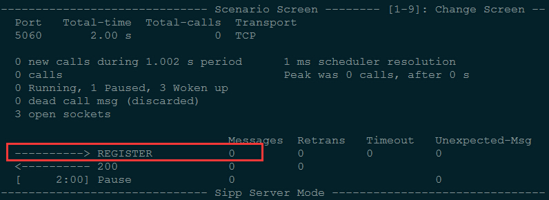
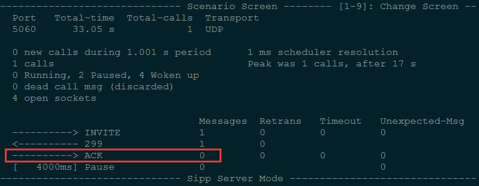

## 针对巴西大客户的网关测试

### 客户问题

	客户反应网关 SIP 消息与他们的不一致，使用 SIPp 设置如下场景以模拟客户实例
	customer：包含客户的问题及网络数据包文件
	网络数据包文件中，192.168.0.109 为 OpenVox GSM Gateway，192.168.0.45 为 IP-PBX
	
### 测试设备

	OpenVox GSM Gateway: 172.16.8.186
		SIP Trunk
			Name: 8888
			User Name: 8888
			Password: 8888
			Registration: None
			Hostname or IP Address: 172.16.8.181
			Transport: UDP
			NAT Traversal: Yes
		注意：除特殊场景 Registration 设置为注册，其他均为 none；除特殊场景 Transport 设置为 TCP 外，其他均为 UDP

		路由：
			SIPp -> 8888 -> GSM -> Mobile
			Mobile -> GSM -> 8888 -> SIPp

	SIPp Server: 172.16.8.181

## 以下为测试场景

	测试时需进入 Test 目录，按照本文档中的命令进行测试

### SIP_RG_RT_V_010

	Q: 网关注册到 PBX，PBX 无响应，重新发起注册的超时时间应为 32s，但网关 20s 后便不重新注册
		重发 Register 周期：T1 = 500ms
			1 * T1 + 2 * T1 + 4 * T1 + 8 * T1 + 8 * T1 + 8 * T1 + 8 * T1 + 8 * T1 + 8 * T1 + 8 * T1 + 1 * T1
	A: 注册超时时间：SIP - Advanced SIP Settings - Parsing and Compatibility - Outbound Registrations - Registration Timeout
		默认为 20s，修改为 32s
	
	测试场景：sip_rg_rt_v_010.xml
	测试方法：
		1. SIPp 端：sipp -sf sip_rg_rt_v_010.xml -p 5060 -i 172.16.8.181 -rsa 172.16.8.186:5060 -trace_msg
		2. 将 GW 上的 SIP Trunk 的 Registration: None 改为 Registration: This gateway register with the endpoint
		3. 检查 SIPp 显示，重传 10 次 REGISTER（32s）后应接收到 Unexpected Message

### SIP_RG_RT_TI_006

	Q: GW 发送 REGISTER，PBX 回应 100 Trying，网关重发 REGISTER，第二次与第一次重发间隔应为 4s
	
	测试场景：sip_rg_rt_ti_006.xml
	测试方法：
		1. 测试方法同 SIP_RG_RT_V_010：sipp -sf sip_rg_rt_ti_006.xml -p 5060 -i 172.16.8.181 -rsa 172.16.8.186:5060 -trace_msg
		3. 检查 SIPp 显示，第二次与第一次重发 REGISTER 的时间间隔应为4s

### SIP_CC_OE_CE_V_038

	Q: 网关发送 INVITE 后，PBX 连续回复 600, 500，网关应只回复一条 ACK，没有重传的 ACK
	
	测试场景：sip_cc_oe_ce_v_038.xml
	测试方法：
		1. SIPp 端：sipp -sf sip_cc_oe_ce_v_038.xml -p 5060 -i 172.16.8.181 -rsa 172.16.8.186:5060 -trace_msg
		2. 用手机呼叫网关
		3. SIPp 应只收到一个 ACK 消息
		

### SIP_CC_OE_CR_TI_006

	Q: 第二个重发的 BYE 消息与第一个重发的 BYE 消息间隔应为 4s
	
	测试场景：sip_cc_oe_cr_ti_006.xml
	测试方法：
		1. SIPp 端：sipp -sf sip_cc_oe_cr_ti_006.xml -p 5060 -i 172.16.8.181 -rsa 172.16.8.186:5060 -trace_msg
		2. 用手机呼叫网关
		3. 第二个重发的 BYE 消息与第一个重发的 BYE 消息间隔应为 4s

### SIP_CC_TE_CE_V_022

	Q: 网关重发同样的 INVITE 之后应该重发上一个 INVITE 的 183 的消息，而不是仅回复 100
	
	测试场景：sip_cc_te_ce_v_022.xml
	测试方法：
		1. SIPp 端：sipp -sf sip_cc_te_ce_v_022.xml -i 172.16.8.181 172.16.8.186:5060 -m 1 -trace_msg
		2. 第二个 INVITE 之后应该重发上一个 INVITE 的 183 的消息

### SIP_CC_TE_CE_TI_001

	Q: 网关接收到不支持扩展的 INVITE，回复 420 后应重发一次 420
	
	测试场景：
	测试方法：
		1. SIPp 端：sipp -sf sip_cc_te_ce_ti_001.xml -i 172.16.8.181 172.16.8.186:5060 -m 1 -trace_msg
		2. 应重发的 420
		

### SIP_CC_TE_CE_TI_011

	Q: 重发 10 次 200OK 之后未回应，网关应发送 BYE 消息
	
	测试场景：sip_cc_te_ce_ti_011.xml
	测试方法：
		1. SIPp 端：sipp -sf sip_cc_te_ce_ti_011.xml -i 172.16.8.181 172.16.8.186:5060 -m 1 -trace_msg
		2. 应接收到 BYE 消息
		

### SIP_CC_TE_SM_I_001

	Q: 网关收到序列号更高的 INVITE 重发请求应当回复 500，而不是 491
	
	测试场景：sip_cc_te_sm_i_001.xml
	测试方法：
		1. SIPp 端：sipp -sf sip_cc_te_sm_i_001.xml -i 172.16.8.181 172.16.8.186:5060 -m 1 -trace_msg
		2. SIPp 应接收到网关回复的 500

### SIP_MG_RT_V_008

	Q: TCP 方式传送，SIPp 收不到网关的 REGISTER
	
	测试场景：sip_mg_rt_v_008.xml
	测试方法：
		1. 网关修改成 TCP 传输方式：SIP - Advanced SIP Settings - Enable TCP: Yes - TCP Bind Port: 5060；SIP Trunk - Transport: TCP，需重启 asterisk
		2. SIPp 端：sipp -sf sip_mg_rt_v_008.xml -p 5060 -i 172.16.8.181 -rsa 172.16.8.186:5060 -t t1 -trace_msg
		3. 将 SIP Trunk 的 Registration: None 改为 Registration: This gateway register with the endpoint
		4. SIPp 应收到网关的注册消息

### SIP_MG_OE_V_003

	Q: 网关收到 299 后应回复 ACK

	测试场景：sip_mg_oe_v_003.xml
	测试方法：
		1. SIPp 端：sipp -sf sip_mg_oe_v_003.xml -p 5060 -i 172.16.8.181 -rsa 172.16.8.186:5060 -trace_msg
		2. 用手机呼叫网关
		3. SIPp 应收到 ACK
		

### sip_cc_oe_ce_v_018

	测试场景：sip_cc_oe_ce_v_018.xml
	测试方法：
		1. sipp -sf sip_cc_oe_ce_v_018.xml -p 5060 -i 172.16.8.181 172.16.8.186:5060 -trace_msg
		2. 用手机呼叫网关
		3. 网关收到 BYE 后应回复 200

### sip_cc_oe_ce_v_019

	Q: 网关收到第二个 200 OK 之后，应当回复 ACK
	
	测试场景：sip_cc_oe_ce_v_019.xml
	测试方法：
		1. SIPp 端：sipp -sf sip_cc_oe_ce_v_019.xml -p 5060 -i 172.16.8.181 172.16.8.186:5060 -trace_msg
		2. 用手机呼叫网关
		3. 检查 SIPp 显示，应当收到第二个 ACK

### sip_cc_oe_ce_v_040

	测试场景：sip_cc_oe_ce_v_040.xml
	测试方法：
		1. SIPp 端：sipp -sf sip_cc_oe_ce_v_040.xml -p 5060 -i 172.16.8.181 172.16.8.186:5060 -trace_msg
		2. 用手机呼叫网关
		3. 603 后需回复一个 ACK，SIPp 上显示为有重发的 ACK 出现

### sip_cc_oe_ce_v_049

	测试场景：sip_cc_oe_ce_v_049.xml
	测试方法：
		1. 网关修改成 TCP 传输方式：SIP - Advanced SIP Settings - Enable TCP: Yes - TCP Bind Port: 5060；SIP Trunk - Transport: TCP，需重启 asterisk
		2. sipp -sf sip_cc_oe_ce_v_049.xml -p 5060 -i 172.16.8.181  172.16.8.186:5060 -t t1 -trace_msg
		3. 用手机呼叫网关
		4. 网关应发送 INVITE

### SIP_CC_OE_CE_TI_012

	Q:32s 后网关收到 200OK，不应再回复 ACK
	
	测试场景：sip_cc_oe_ce_ti_012.xml
	测试方法：
		1. SIPp 端：sipp -sf sip_cc_oe_ce_ti_012.xml -p 5060 -i 172.16.8.181  172.16.8.186:5060 -trace_msg
		2. 用手机呼叫网关
		3. 通话 32s 后 SIPp 向网关发送 200OK，网关不应该回复 ACK

### SIP_CC_OE_CR_TI_002

	测试场景：sip_cc_oe_cr_ti_002.xml
	测试方法：
		1. SIPp 端：sipp -sf sip_cc_oe_cr_ti_002.xml -p 5060 -i 172.16.8.181  172.16.8.186:5060 -trace_msg
		2. 用手机呼叫网关
		3. 第二个重发的 BYE 与第一个应间隔 1s，而不是 4s

### SIP_CC_TE_CE_V_020

	测试场景：sip_cc_te_ce_v_020.xml
	测试方法：
		1. SIPp 端：sipp -sf sip_cc_te_ce_v_020.xml -i 172.16.8.181 172.16.8.186:5060 -m 1 -trace_msg
		2. 抓包或者查看 SIPp log，发出 INVITE 后是否有回复

### SIP_CC_TE_CE_V_033

	测试场景：sip_cc_te_ce_v_033.xml
	测试方法：
		1. SIPp 端：sipp -sf sip_cc_te_ce_v_033.xml -i 172.16.8.181 172.16.8.186:5060 -m 1 -trace_msg
		2. 发出 ACK 后网关应终止 420

### SIP_CC_TE_CE_I_001

	测试场景：sip_cc_te_ce_i_001.xml
	测试方法：
		1. SIPp 端：sipp -sf sip_cc_te_ce_i_001.xml -i 172.16.8.181 172.16.8.186:5060 -m 1 -trace_msg
		2. 发出 ACK 后网关应终止 420

### SIP_CC_TE_CE_I_002

	测试场景：sip_cc_te_ce_i_002.xml
	测试方法：
		1. SIPp 端：sipp -sf sip_cc_te_ce_i_002.xml -i 172.16.8.181 172.16.8.186:5060 -m 1 -trace_msg
		2. 发出 ACK 后网关应终止 420

### SIP_CC_TE_CE_TI_007

	测试场景：sip_cc_te_ce_ti_007.xml
	测试方法：
		1. SIPp 端：sipp -sf sip_cc_te_ce_ti_007.xml -i 172.16.8.181 172.16.8.186:5060 -m 1 -trace_msg
		2. 发出 ACK 后网关应终止 420

### sip_mg_te_v_015

	Q: 使用 TCP 传输，网关应该忽略 INVITE 消息前面的回车换行
	
	测试方法：
		1. 网关修改成 TCP 传输方式：SIP - Advanced SIP Settings - Enable TCP: Yes - TCP Bind Port: 5060；SIP Trunk - Transport: TCP，需重启 asterisk
		2. 使用 172.16.6.97 向网关发送 INVITE
		3. 网关应按照正常的 INVITE 处理