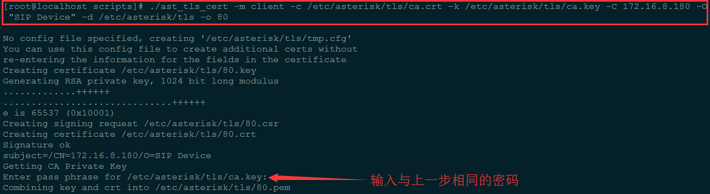

### Asterisk TLS

	http://m.osslab.com.tw/VoIP/IP_PBX/%E8%BB%9F%E9%AB%94%E5%BC%8F_IP_PBX/Asterisk/Tips/%E8%A8%AD%E7%BD%AE_Asterisk_%E7%9A%84%E5%AE%89%E5%85%A8%E6%80%A7_(security)/Configuring_Asterisk_with_TLS_enabled
	
	https://wiki.asterisk.org/wiki/display/AST/SIP+TLS+Transport
	
	https://wiki.asterisk.org/wiki/display/AST/Secure+Calling+Tutorial
	
	[Configuring_Asterisk_with_TLS_enabled](http://m.osslab.com.tw/VoIP/IP_PBX/%E8%BB%9F%E9%AB%94%E5%BC%8F_IP_PBX/Asterisk/Tips/%E8%A8%AD%E7%BD%AE_Asterisk_%E7%9A%84%E5%AE%89%E5%85%A8%E6%80%A7_(security)/Configuring_Asterisk_with_TLS_enabled)
	[SIP+TLS+Transport](https://wiki.asterisk.org/wiki/display/AST/SIP+TLS+Transport)
	[Secure+Calling+Tutorial](https://wiki.asterisk.org/wiki/display/AST/Secure+Calling+Tutorial)

### Asterisk Configuration

	1. 使用 Asterisk 源码中的工具生成 Asterisk 服务器及 SIP Phone 相关的验证文件：
		mkdir /etc/asterisk/tls
		cd /usr/src/asterisk-13.1.0/contrib/scripts/
		./ast_tls_cert -C 172.16.200.80 -O "Asterisk Server" -d /etc/asterisk/tls （Asterisk 服务器验证文件）
		./ast_tls_cert -m client -c /etc/asterisk/tls/ca.crt -k /etc/asterisk/tls/ca.key -C 172.16.8.180 -O "SIP Device" -d /etc/asterisk/tls -o 80 （SIP Phone 验证文件）

	2. 配置 SIP 全局参数
		vim /etc/asterisk/sip.conf
		[general]
		tlsenable=yes
		;tlsbindaddr=0.0.0.0
		tlscertfile=/etc/asterisk/tls/asterisk.pem
		;tlscafile=/etc/asterisk/tls/ca.crt
		;tlscipher=ALL
		;tlsclientmethod=tlsv1

	3. 配置 SIP 账号
		vim /etc/asterisk/sip_endpoints.conf
		[10001]
		type=friend
		host=dynamic
		username=10001
		secret=10001
		context=from-sip
		transport=tls
		encryption=yes
		disallow=all
		allow=alaw

### SIP Phone Configuration

#### Blink

	1. 创建 SIP 账号 10001

	2. 设置 SRTP Encryption，默认为 optional

#### 注意：如果 Asterisk 的 SIP 账号使用了 encryption=yes，要将其设为 mandatory，且 asterisk 必须加载 res_srtp.so 模块

	3. 配置对应的服务器，TLS 默认使用 5061 端口
	

	4. 设置 Asterisk 服务器生成的 SIP Phone TLS 验证文件

	5. 设置 Asterisk 服务器生成的服务器验证文件（可忽略此步骤）

#### Zoiper

	1. 创建 SIP 账号 10001，使用 5061 端口

	2. 设置 TLS/SRTP 传输，设置 Asterisk 服务器生成的 SIP Phone TLS 验证文件

	3. 设置 Asterisk 服务器生成的服务器验证文件

