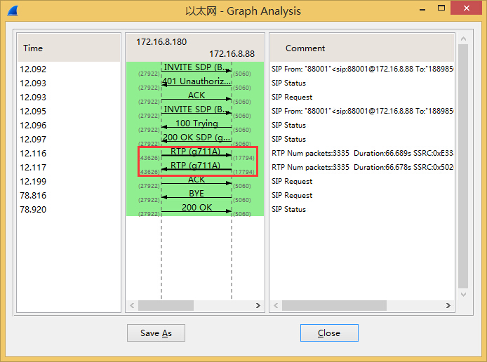

## SIPp

	SIPp 是一个测试 SIP 协议性能的工具软件
	
	工作中曾使用此工具针对巴西客户的 SIP 环境进行测试，测试文件在 voip/gsmgateway/Brazil_test
	
### 安装

	安装依赖：
		yum install gcc-c++ gcc automake autoconf libtool make
		yum install ncurses ncurses-devel
		yum install openssl
		yum install libpcap libpcap-devel libnet
		yum install lksctp-tools lksctp-tools-devel

	编译安装：
		./configure --with-sctp --with-pcap --with-openssl
		make
		make install

### SIPp 自带用户代理工作流程

	uac、uas、regexp、branchc、branchs、3pcc-C-A、3pcc-C-B、3pcc-A、3pcc-B

	可使用命令导出自带的用户代理工作流程到文件中，例如：
		sipp -sd uac >> uac.xml

### SIPp 作为 SIP 服务器端

	sipp -sf 场景文件 -p 本地端口 -i 本地IP -rsa 对端IP:对端端口 -trace_msg
	
### SIPp 作为 SIP 客户端

	sipp -sf 场景文件 -i 本地IP 对端IP:对端端口 -m 最大呼叫量 -trace_msg
	sipp 172.16.8.88:5060 -i 172.16.8.181 -sf sipp-uac-register.xml -inf 3001-register.csv -m 10 -l 10 -d 10000 -r 10 -rp 10000

	172.16.8.88:5060		表示远端服务器的 IP 和端口（Asterisk Server）
	-i 172.16.8.181			表示本机（SIPp 端）的IP
	-sf sipp-uac-register.xml	表示使用的XML场景文件是sipp-uac-register.xml
								该场景文件用于注册到 Asterisk，暂停一会儿后取消注册
	-inf 3001-register.csv		表示使用的 CSV 统计数据转储文件是 3001-register.csv
	-m 10					表示最大呼叫数为 10
	-l 10					表示最大并发数为 10
	-d 10000				对应 XML 文件中使用 pause 的参数，如果 pause 没有指定参数，则使用 -d 选项的参数，表示暂停 10000ms
	-r 10 -rp 10000			表示10000ms内发起10次呼叫
	
### 相关文件介绍

#### CSV 统计数据转储文件

	定义 XML 场景文件中的相关变量，命令行使用 “-inf 文件名” 
	第一行申明变量的读取方式：顺序读取（SEQUENTIAL）、随机读取（RANDOM）、基于用户（USER）
	之后每一行对应一个呼叫，使用 “;” 分隔符分隔每一项数据，分开的项在脚本中作为变量名 [filed0]，[field1]……[fieldn] 来引用

#### XML的场景文件

	描述 SIP 工作流程

	[field0]		匹配 CSV 配置文件第二行开始的每行第一列数据
	[field1]		匹配 CSV 配置文件第二行开始的每行第二列数据
	[fieldn]		匹配 CSV 配置文件第 n 行开始的每行第二列数据
	[remote_ip]		匹配命令行参数的远端服务器 IP
	[remote_port]	匹配命令行参数的远端服务器 PORT
	[local_ip] 		匹配命令行参数 –i 设置的本地 IP
	其他’[]’表示的参数SIPp可自动获取
	
	注意：传递语音流（g711a.pcap）后暂停，暂停时间可由-d指定
	
### 自制 SIPp 语音流

	工具：AsteriskServer、Eyebeam、Wireshark
	
	Server 端：AsteriskServer
		SIP Trunk
			[88001]
			username=88001
			secret=88001
			context=from-sip
			type=friend
			host=dynamic
			disallow=all
			allow=alaw
			

			
		Routing Rules:
			[from-sip]
			exten => _X.,1,Answer()
			exten => _X.,n,Playback(demo-instruct)
			exten => _X.,n,Hangup()

			
	Client 端：
		Wireshark 抓包
		Eyebeam 使用 88001 注册到 AsteriskServer，呼叫任意号码等待对端挂机
		Wireshark 停止抓包
	
	Wireshark 中查看语音流编码
		1、Telephony - RTP - Show All Streams - g711A
		2、Telephony - VoIP Calls - Flow -> RTP (g711A)
		

	过滤并保存 RTP 包：
		过滤：ip.src == AsteriskServerIP and ip.dst == EyebeamIP and rtp
		导出：Export Specified Packets - All packages - Displayed - 保存类型：wireshark/tcpdump - 后缀.pcap

