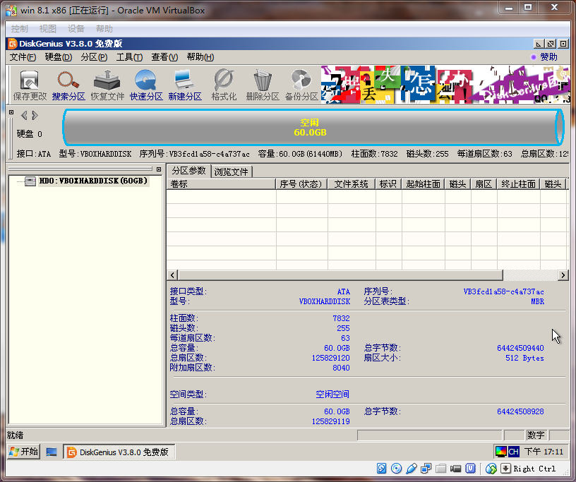
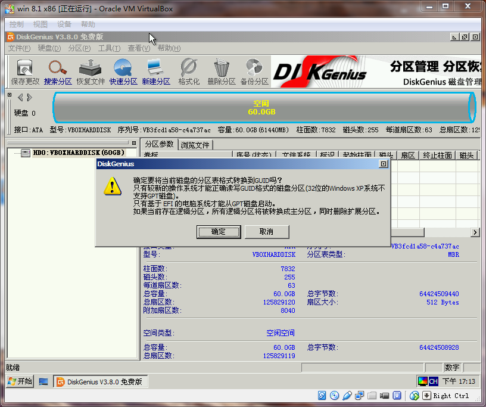
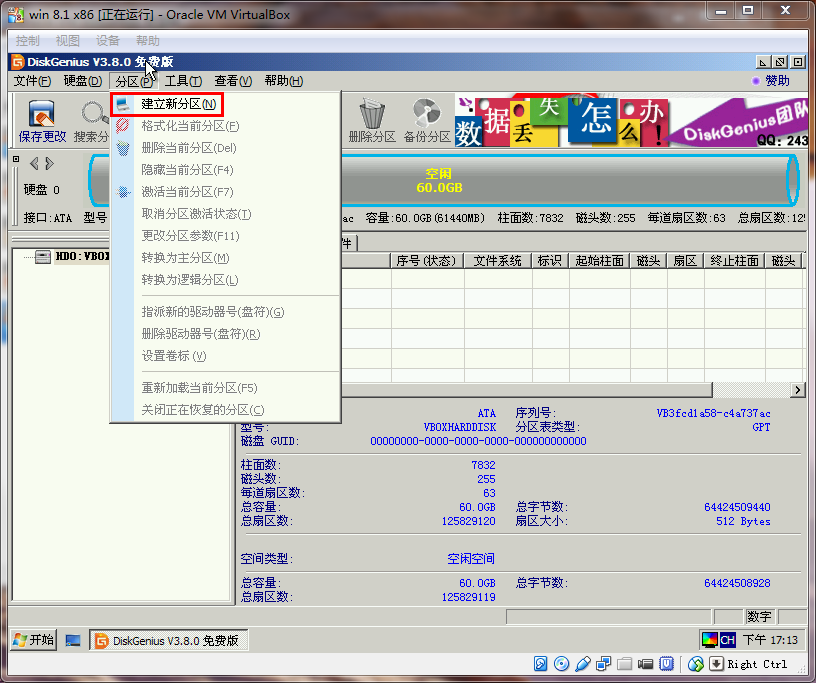
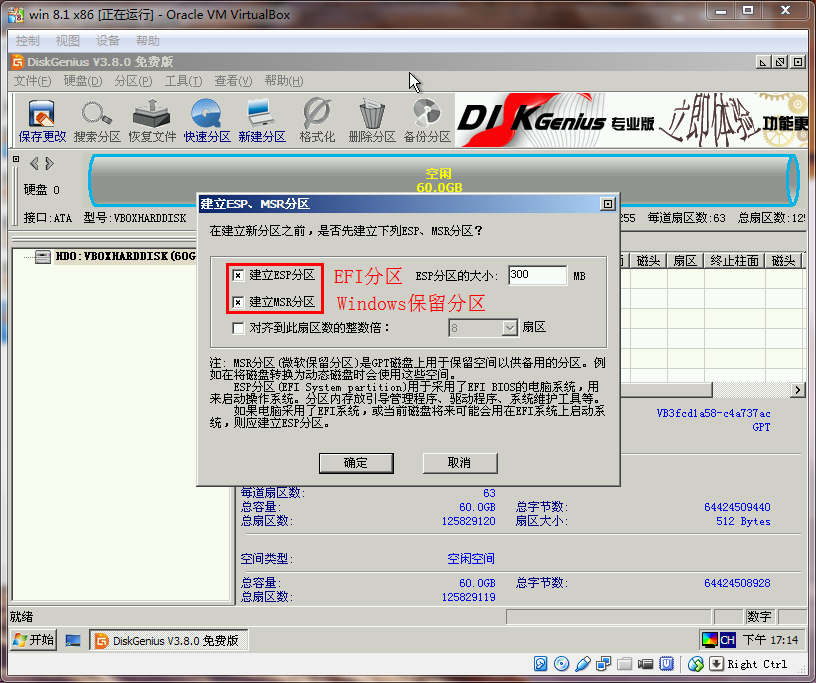
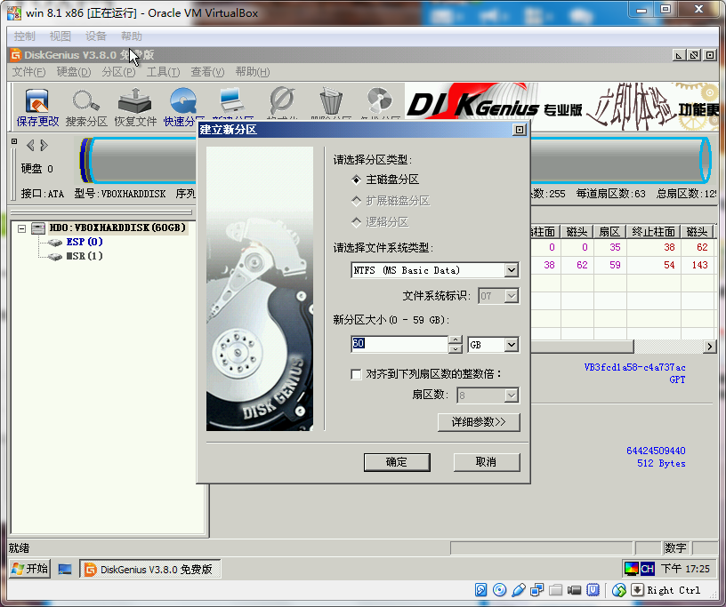
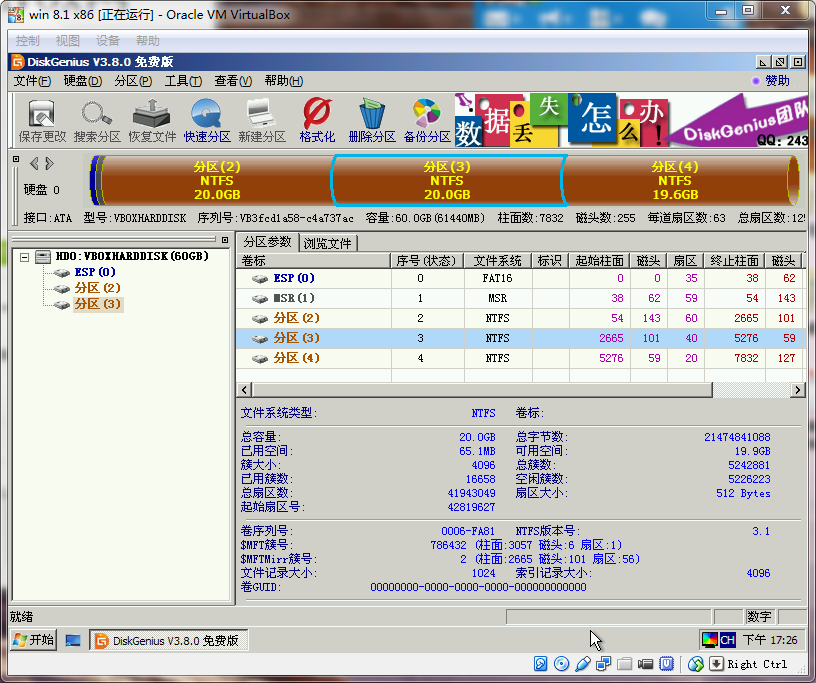

## GUID+EFI

### 使用 WinPE 将空白磁盘转换成 GUID 格式并分区

	WinPE 系统 -> DiskGenius -> 空白硬盘 -> 硬盘 -> 转换分区表类型为GUID格式 -> 分区 -> 建立新分区（ESP(EFI)+MSR(Win保留)） -> 添加其他分区

	
### Vmware 添加 EFI

	编辑文件（虚拟机名称.vmx），添加：firmware = "EFI"