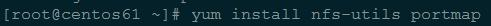

# OpenVox GSM Gateway 上挂载 NFS

Here's our logo (hover to see the title text):

Inline-style:

Reference-style:
![alt text1][logo]

[logo]: assets/logo-white.png

## （一）NFS 服务器配置

	本 NFS 服务器为 CentOS 5.9，CentOS 6 以上请将以下 portmap 改为 rpcbind

	安装相关软件：
		yum install nfs-utils portmap
		
images/packages.jpg
	

![hello][logo]

[logo]: images/packages.jpg
	
 
 
	配置允许访问的主机，编辑文件 /etc/hosts.allow：
		vi /etc/hosts.allow
		portmap:172.16.210.1
 
	配置拒绝访问的主机，编辑文件 /etc/hosts.deny：
		vi /etc/hosts.deny
		portmap:ALL
 
	配置共享目录信息，编辑文件 /etc/exports：
		vi /etc/exports
		/nfs-share 172.16.210.1(rw,sync,all_squash,anonuid=0,anongid=0)
 
	使共享目录设置生效：
		exports -r
		exports
 
	启动NFS服务：
 		service portmap start
		service nfs start

	检查NFS共享目录设置：
		showmount -e 172.16.8.61
 
## （二）OpenVox GSM Gateway 挂载 NFS

	挂载 NFS 共享目录：
		cd /etc/asterisk
		mkdir nfs
		mount -o nolock -t nfs 172.16.8.61:/nfs-share nfs
 
	在 NFS 共享目录中创建文件：
		cd nfs
		echo "hello" > hello.txt
		pwd
 
	在 NFS 服务器中查看创建的文件：
		cd /nfs-share
		ls
		cat hello.txt
		pwd
 
	卸载 NFS 共享目录：
		umount nfs
		ls nfs