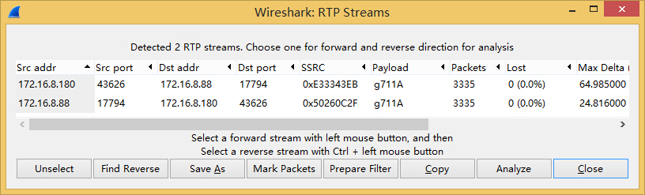

## SIPp

### SIPp 作为 SIP 服务器端

	sipp -sf 场景文件 -p 本地端口 -i 本地IP -rsa 对端IP:对端端口 -trace_msg
	
### SIPp 作为 SIP 客户端

	sipp -sf 场景文件 -i 本地IP 对端IP:对端端口 -m 最大呼叫量 -trace_msg
	
### 自制 SIPp 语音流

	工具：AsteriskServer、Eyebeam、Wireshark
	
	Server 端：AsteriskServer
		SIP Trunk
			[88001]
			username=88001
			secret=88001
			context=from-sip
			type=friend
			host=dynamic
			disallow=all
			allow=alaw
			

			
		Routing Rules:
			[from-sip]
			exten => _X.,1,Answer()
			exten => _X.,n,Playback(demo-instruct)
			exten => _X.,n,Hangup()

			
	Client 端：
		Wireshark 抓包
		Eyebeam 使用 88001 注册到 AsteriskServer，呼叫任意号码等待对端挂机
		Wireshark 停止抓包
	
	Wireshark 中查看语音流编码
		1、Telephony - RTP - Show All Streams - g711A
		2、Telephony - VoIP Calls - Flow -> RTP (g711A)
		

	过滤并保存 RTP 包：
		过滤：ip.src == AsteriskServerIP and ip.dst == EyebeamIP and rtp
		导出：Export Specified Packets - All packages - Displayed - 保存类型：wireshark/tcpdump - 后缀.pcap

