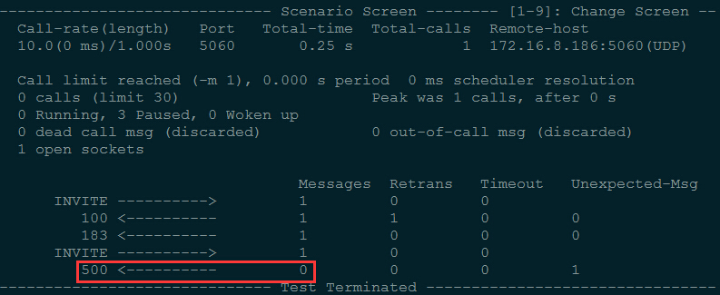

## 针对巴西大客户的网关测试

	SIPp 作为服务器端响应 GW 的 SIP 消息
	例如：sipp -sf uas_basic.xml -p 5060 -i 172.16.8.88 -rsa 172.16.179.1:5060 -trace_msg

	sipp -sf XML_FILE -p 5060 -i SIPpIP -rsa Gateway:5060 -trace_msg

### 客户问题

	voxmundi_sip_logs：包含客户的问题及网络数据包文件
	网络数据包文件中，192.168.0.109 为 OpenVox GSM Gateway，192.168.0.45 为 IP-PBX
	
### 测试设备

	SIM卡短号：66379，长号：15728748691

## 以下为测试场景
	
### SIP_RG_RT_V_010

	Q: 网关注册到 PBX，PBX 无响应，重新发起注册的超时时间应为 32s，但网关 20s 后便不重新注册
		重发 Register 周期：T1 = 500ms
			1 * T1 + 2 * T1 + 4 * T1 + 8 * T1 + 8 * T1 + 8 * T1 + 8 * T1 + 8 * T1 + 8 * T1 + 8 * T1 + 1 * T1
	A: 注册超时时间：SIP - Advanced SIP Settings - Parsing and Compatibility - Outbound Registrations - Registration Timeout
		默认为 20s，修改为 32s
	
	测试场景：sip_rg_rt_v_010.xml
	测试方法：
		1. SIPp 端：sipp -sf sip_rg_rt_v_010.xml -p 5060 -i 172.16.8.88 -rsa 172.16.8.186:5060 -trace_msg
		2. SIPp 端：tcpdump -s 0 -i enp4s2 -w test.pcap 抓包
		3. GW 端：
			1)建立 SIP Trunk
				Name: 8888
				User Name: 8888
				Password: 8888
				Registration: None
				Hostname or IP Address: 172.16.8.88
				Transport: UDP
				NAT Traversal: Yes
			2)将上面的 Registration: None 改为 Registration: This gateway register with the endpoint
		3. 检查 SIPp 或数据包，看是否在重传 10 次 REGISTER（32s）后接收到 Unexpected Message

### SIP_RG_RT_TI_006

	Q: GW 发送 REGISTER，PBX 回应 100 Trying，网关重发 REGISTER，第二次与第一次重发间隔应为 4s
	
	测试场景：sip_rg_rt_ti_006.xml
	测试方法：基本同 SIP_RG_RT_V_010，检查第二次与第一次重发 REGISTER 的时间间隔
		1. SIPp 端：sipp -sf sip_rg_rt_ti_006.xml -p 5060 -i 172.16.8.88 -rsa 172.16.8.186:5060 -trace_msg
		2. SIPp 端：tcpdump -s 0 -i enp4s2 -w test.pcap 抓包
		3. GW 端：
			1)建立 SIP Trunk
				Name: 8888
				User Name: 8888
				Password: 8888
				Registration: None
				Hostname or IP Address: 172.16.8.88
				Transport: UDP
				NAT Traversal: Yes
			2)将上面的 Registration: None 改为 Registration: This gateway register with the endpoint
		3. 检查 SIPp 或数据包，检查第二次与第一次重发 REGISTER 的时间间隔

### sip_cc_oe_ce_v_019

	Q: 网关收到第二个 200 OK 之后，应当回复 ACK
	
	测试场景：sip_cc_oe_ce_v_019.xml
	测试方法：基本同 SIP_RG_RT_V_010，检查是否收到第二个 ACK
		1. SIPp 端：sipp -sf sip_cc_oe_ce_v_019.xml -p 5060 -i 172.16.8.88 -rsa 172.16.8.186:5060 -trace_msg
		2. GW 端：建立 SIP Trunk
			Name: 8888
			User Name: 8888
			Password: 8888
			Registration: None
			Hostname or IP Address: 172.16.8.88
			Transport: UDP
			NAT Traversal: Yes
		3. 用手机呼叫网关：Mobile -> GSM -> 8888 -> SIPp
		4. 检查是否收到第二个 ACK
		

	
### SIP_CC_OE_CE_V_038

	Q: 网关发送 INVITE 后，PBX 连续回复 600, 500，网关应只回复一条 ACK，没有重传的 ACK
	
	测试场景：sip_cc_oe_ce_v_038.xml
	测试方法：
		1. SIPp 端：sipp -sf sip_cc_oe_ce_v_038.xml -p 5060 -i 172.16.8.88 -rsa 172.16.8.186:5060 -trace_msg
		2. GW 端：
			1)建立 SIP Trunk
				Name: 8888
				User Name: 8888
				Password: 8888
				Registration: None
				Hostname or IP Address: 172.16.8.181
				Transport: UDP
				NAT Traversal: Yes
			2)用手机呼叫网关：Mobile -> GSM -> 8888 -> SIPp
		3. SIPp 应只收到一个 ACK 消息
		

### SIP_CC_OE_CE_TI_012

### SIP_CC_OE_CR_TI_006

### SIP_CC_TE_CE_V_022

	Q: 网关重发同样的 INVITE 之后应该发送回复上一个 INVITE 的 100, 183 的重发消息，而不是回复 482，然后手机振铃
	
	测试场景：sip_cc_te_ce_v_022.xml
	测试方法：
		1. GW 端：
			1)建立 SIP Trunk
				Name: 8888
				User Name: 8888
				Password: 8888
				Registration: None
				Hostname or IP Address: 172.16.8.181
				Transport: UDP
				NAT Traversal: Yes
			2）路由：SIPp -> 8888 -> GSM -> Mobile
		2. SIPp 端：sipp -sf sip_cc_te_ce_v_022.xml -i 172.16.8.88 172.16.8.186:5060 -m 1 -trace_msg
		3. 第二个 INVITE 之后应收到 100 Trying, 183 然后手机振铃

### SIP_CC_TE_CE_TI_001

### SIP_CC_TE_CE_TI_011

	Q: 重发 10 次 200OK 之后未回应，网关应发送 BYE 消息
	
	测试场景：sip_cc_te_ce_ti_011.xml
	测试方法：
		1. GW 端：
			1)建立 SIP Trunk
				Name: 8888
				User Name: 8888
				Password: 8888
				Registration: None
				Hostname or IP Address: 172.16.8.181
				Transport: UDP
				NAT Traversal: Yes
			2）路由：SIPp -> 8888 -> GSM -> Mobile
		2. SIPp 端：sipp -sf sip_cc_te_ce_ti_011.xml -i 172.16.8.88 172.16.8.186:5060 -m 1 -trace_msg
		3. 查看是否接收到 BYE 消息
		

### SIP_CC_TE_SM_I_001

	Q: 网关收到序列号更高的 INVITE 重发请求应当回复 500，而不是 491
	
	测试场景：sip_cc_te_sm_i_001.xml
	测试方法：
		1. GW 端：
			1)建立 SIP Trunk
				Name: 8888
				User Name: 8888
				Password: 8888
				Registration: None
				Hostname or IP Address: 172.16.8.181
				Transport: UDP
				NAT Traversal: Yes
			2)路由：SIPp -> 8888 -> GSM -> Mobile
		2. SIPp 端：sipp -sf sip_cc_te_sm_i_001.xml -i 172.16.8.88 172.16.8.186:5060 -m 1 -trace_msg
		3. 查看是否接收到网关回复的 500

### SIP_MG_RT_V_008

	Q: TCP 方式传送，SIPp 收不到网关的 REGISTER
	
	测试场景：sip_mg_rt_v_008.xml
	测试方法：
		1. SIPp 端：sipp -sf sip_mg_rt_v_008.xml -p 5060 -i 172.16.8.88 -rsa 172.16.8.186:5060 -t t1 -trace_msg
		2. GW 端：
			1)建立 SIP Trunk
				Name: 8888
				User Name: 8888
				Password: 8888
				Registration: None
				Hostname or IP Address: 172.16.8.88
				Transport: TCP
				NAT Traversal: Yes
			2)SIP - Advanced SIP Settings - Enable TCP: Yes - TCP Bind Port: 5060
			3)将上面的 Registration: None 改为 Registration: This gateway register with the endpoint
		3. 检查 SIPp 是否收到网关的注册消息

		
### SIP_MG_OE_V_003

	Q: 网关收到 299 后应回复 ACK

	测试场景：sip_mg_oe_v_003.xml
	测试方法：
		1. SIPp 端：sipp -sf sip_mg_oe_v_003.xml -p 5060 -i 172.16.8.88 -rsa 172.16.8.186:5060 -trace_msg
		2. GW 端：
			1)建立 SIP Trunk
				Name: 8888
				User Name: 8888
				Password: 8888
				Registration: None
				Hostname or IP Address: 172.16.8.181
				Transport: UDP
				NAT Traversal: Yes
			2)用手机呼叫网关：Mobile -> GSM -> 8888 -> SIPp
		3. 检查是否收到 ACK
		

### sip_mg_te_v_015

		1. GW 端：
			1)建立 SIP Trunk
				Name: 8888
				User Name: 8888
				Password: 8888
				Registration: None
				Hostname or IP Address: 172.16.8.181
				Transport: TCP
				NAT Traversal: Yes
			2)SIP - Advanced SIP Settings - Enable TCP: Yes - TCP Bind Port: 5060
			3)路由：SIPp -> 8888 -> GSM -> Mobile
		2. SIPp 端：sipp -sf sip_mg_te_v_015.xml -i 172.16.8.88 172.16.8.186:5060 -m 1 -t t1 -trace_msg
		

	SIP_RG_RT_V_010			OK 配置问题
	SIP_RG_RT_TI_006		暂时不测
	SIP_CC_OE_CE_V_019		OK
	SIP_CC_OE_CE_V_038		OK
	SIP_CC_OE_CE_TI_012		NO
	SIP_CC_OE_CR_TI_006		NO
	SIP_CC_TE_CE_V_022		尚未测试
	SIP_CC_TE_CE_TI_001		NO
	SIP_CC_TE_CE_TI_011		OK
	SIP_CC_TE_SM_I_001		OK
	SIP_MG_RT_V_008			尚未测试
	SIP_MG_OE_V_003			OK
	sip_mg_te_v_015 		OK 配置问题