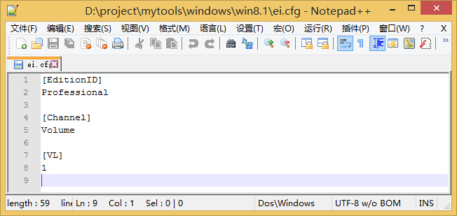

## Windows tools

	Windows下收集的一些工具

### Win8.1 安装密钥

	专业版：XHQ8N-C3MCJ-RQXB6-WCHYG-C9WKB
	数据中心版：BH9T4-4N7CW-67J3M-64J36-WW98Y
	标准版：NB4WH-BBBYV-3MPPC-9RCMV-46XCB
	
### Win8.1 跳过安装密钥

	新建文件 ei.cfg，保存到 Win8.1 U 盘启动盘 X:\sources 目录（X：代表 U 盘盘符），内容如下：
		[EditionID]
		Professional

		[Channel]
		Volume

		[VL]
		1

		
	说明：
		1. [EditionID]：版本名称
			零售版系统包含 Professional、Core 两个版本（其他也包括 ProfessionalWMC、Enterprise）
		2. [Channel]：渠道，
			零售（Retail）、批量授权（Volume）、OEM（OEM）
		3. [VL]：是否为批量版，可选数值 0 或者 1
			0 代表 Retail 零售版，1 代表 Volume 批量授权版